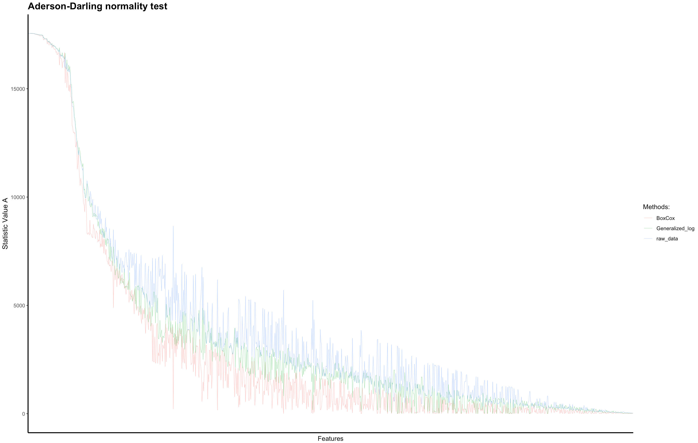
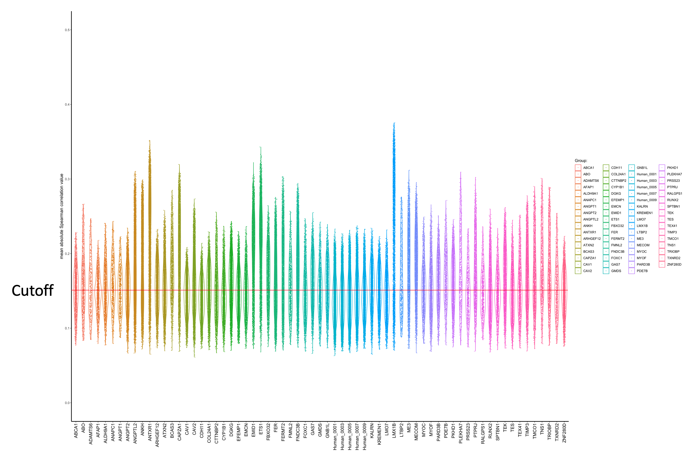
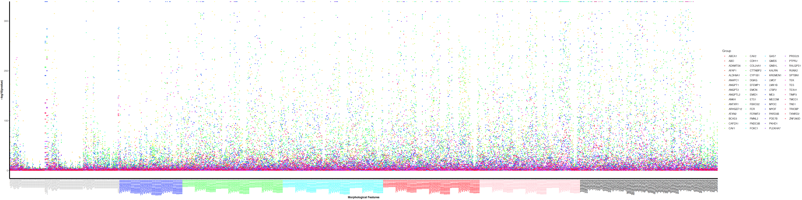
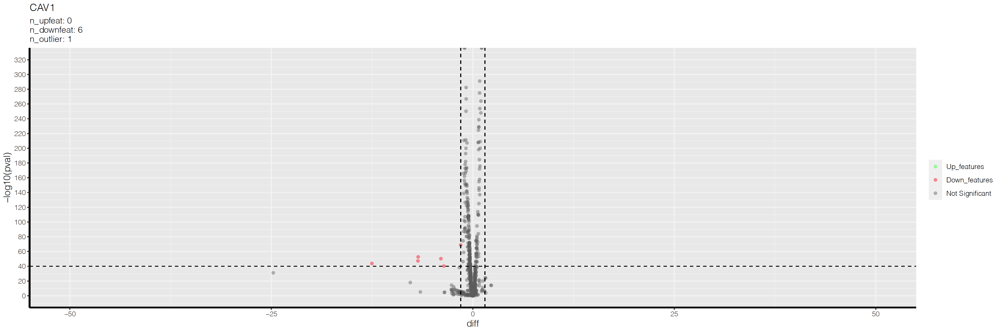
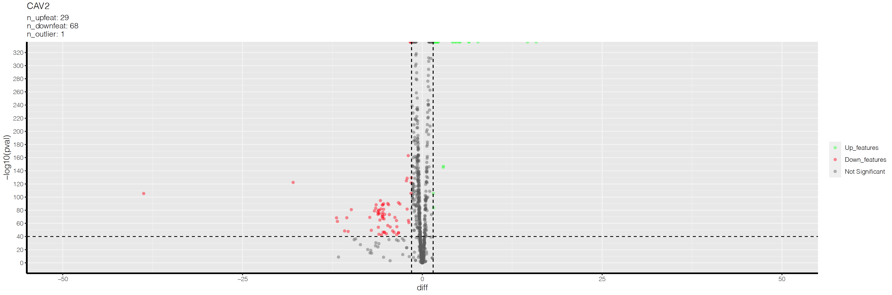
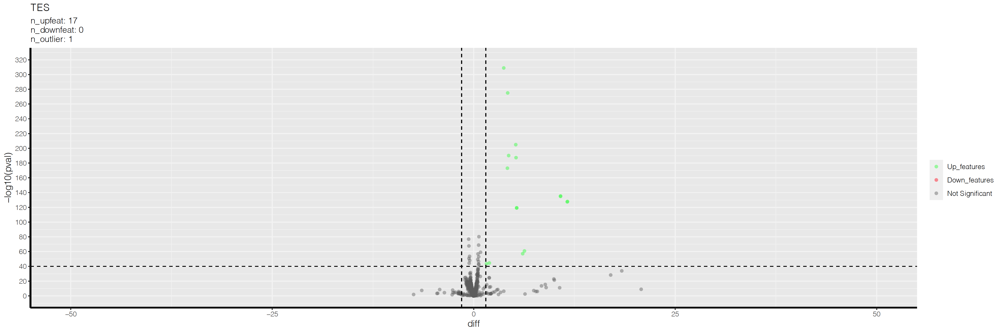

# CROP_seq_Cellpainting
This repository describes the procedures of processing the image datasets of CROPseq experiments using Cellpainting methods.
## Data preparation
#
### Features extraction
 The image datasets were taken on ZEISS Celldiscoverer 7 system. The methods of [CellPainting](https://www.ncbi.nlm.nih.gov/pmc/articles/PMC5223290/) were used to extract the morphological features of individual cells. The [pipelines](Pipelines/) were created in CellProfiler (Version 3.1.9), which contains 3 parts, illumination correction, quality control, and features extraction. Also, the pipelines of generating individual images of each cells were created from the features extraction parts.

To extract the features, the CellProfiler were deployed in Linux environments in the Nectar Cloud (The National eResearch Collaboration Tools and Resources project). [Here](NectarSetup/), 8 virtual machines were set up to process the image datasets, each of which has 32 virtual CPUs and 64 GB of RAM. The process took a few days to finish and the analysis output a set of SQLite files. In total, the experiment contains 3 batches and each batch contains 5 plates of cells. 

[Read the sqlite database and generate *.csv file](R/Read_sql_database_CP.R) which contains features of all cells, and the [metadata](metadata/) of which gene was knockout is also added to the exported *.csv files.  

#
Next procedures are mainly following the methods described by [Caicedo, et al.](https://www.nature.com/articles/nmeth.4397).

[Codes](R/Data_Transformation_normalization_filtering.R) for the data transformation, normalization and filtering. 
### Transformation
The groups of all nontargeting controls were filtered to explore the distribution of each features. The Anderson-Darling test was performed to evaluate the normality of each feature. Here, two transformation methods were applied, generalized logarithmic function and Box-Cox transformation. Below figure shows the results of the Anderson-Darling test, and the Box-Cox transformation shows a better effect on the normality transformation compared to the generalized logarithm. Thus, the Box-Cox transformation method would be applied to the whole groups.   

### Normalization
The value of each feature was normalized by subtracting the median value of each feature from the control group and dividing by the corresponding median absolute deviation (MAD)*1.4826 in each plate, respectively.
### Filtering by Spearman's rank correlation
The Spearman's rank correlation of individual cells was calculated for each group. To get rid of the non-correlated cells from each group, the mean absolute Spearman correlation value of each group was calculated and the cutoff was set as 0.15.

This figure presents the mean absolute Spearman's rank correlation values of each group:

The figures of Spearman's rank correlation of human nontargeting controls before and after the filtering:
 

## [Data analysis](R/Data_Analysis.R)
Here, we aim to find out the most representive features for each groups or each clusters.  
The student t-test was performed for each features of each groups versus the control to filter the features roughly. There are some pval reach the lower limit of R, which returns to a value of 0. 
This figure plots the pval of each features of each groups versus the control. The x labels were clutered and colored, the grey ones are AreaShape features, the blue ones are the nucleus features which stained by Hoechst 33342, the green ones are the ER features which stained by Concanavalin A, the cyan ones are the RNA features which stained by Syto14, the red ones are the AGP features which stained by Wheat Germ Agglutinin and Phalloidin, the pink ones are the Mitochondrial features which stained by Mitotracker, and the black ones are the correlation features of each pair of the channel above.  

A volcano plot was also drawn of each groups, the x-axis is the difference between the mean value of each feature in the group versus the mean value of each feature in the control, and the y-axis is the -log10 value of each comparison. Here the cutoff of the pval was set as 1e-40, and the cutoff of the diff was set as +/- 1.5. Below figures are the volcano plots of the CAV1, CAV2, and TES group. 

